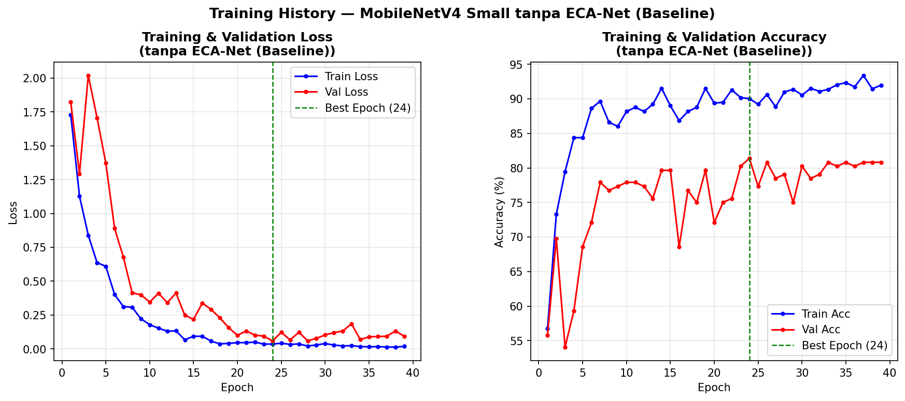
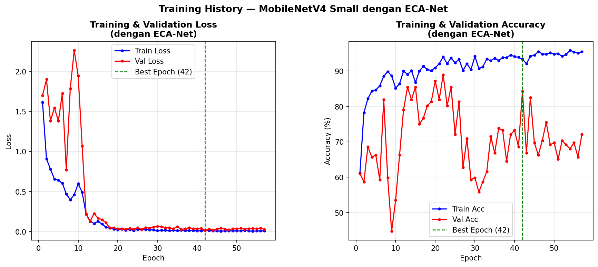
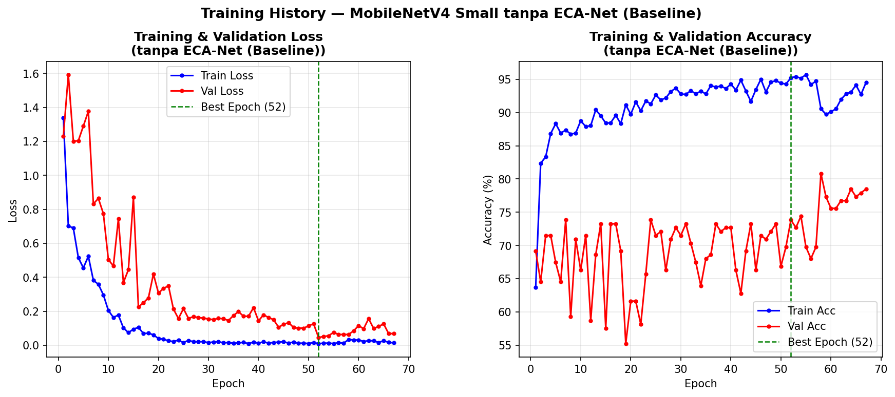
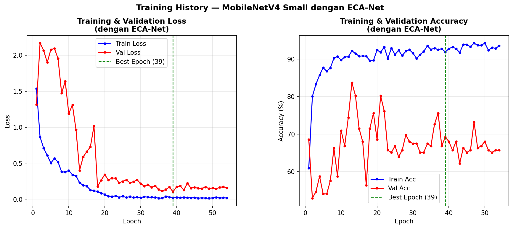
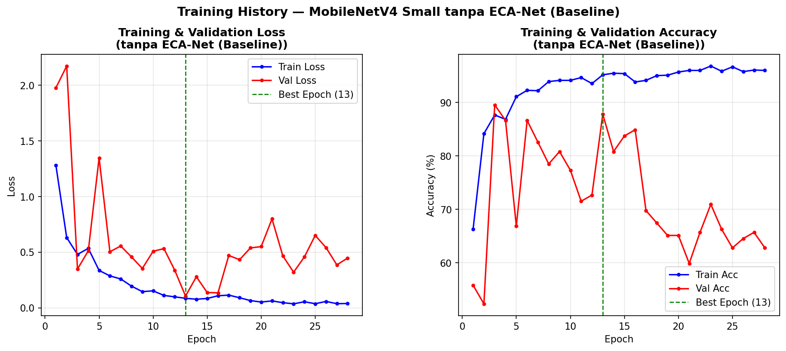
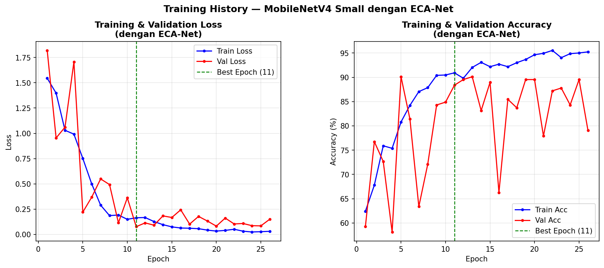
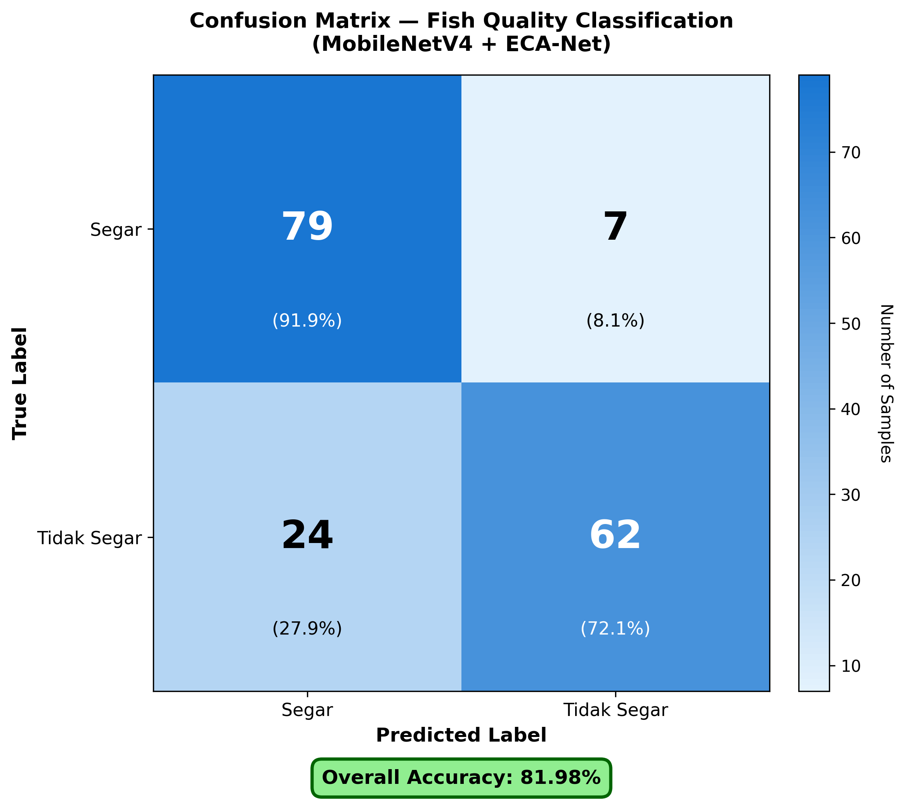
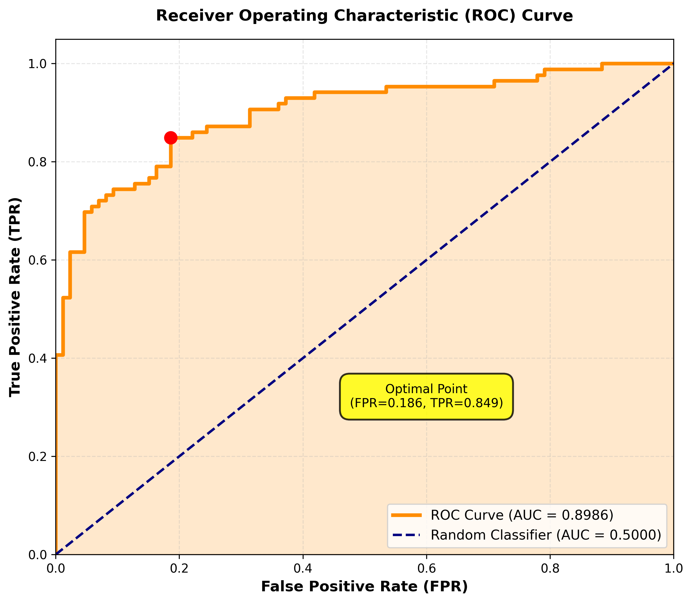
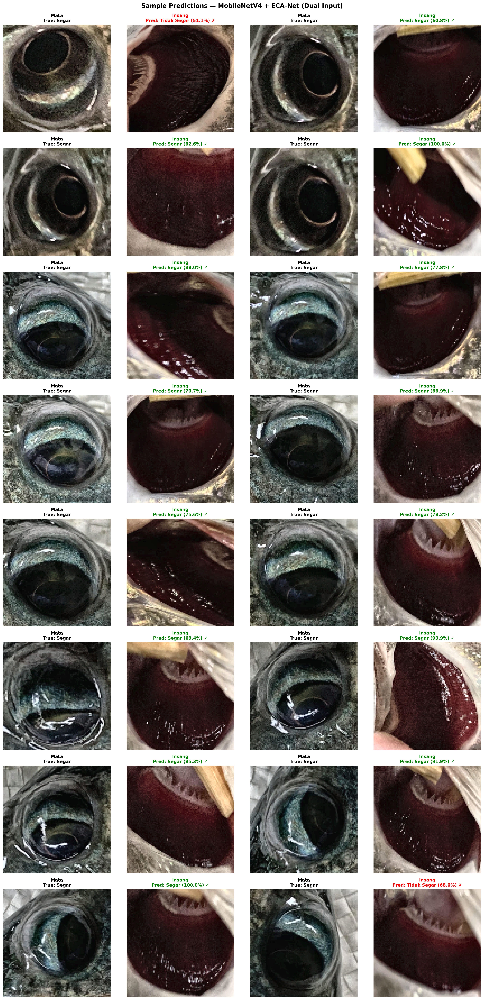

# Fish Quality Classification using MobileNetV4 with ECA-Net

Classification of Tilapia Fish Quality Based on Gill and Eye Images Using **MobileNetV4 Small** with **Efficient Channel Attention (ECA-Net)**.

This repository contains the implementation of my undergraduate thesis.

# Overview

This research aims to classify the quality of tilapia fish into two categories:

- Fresh
- Not Fresh

The proposed approach compares the performance of:

- MobileNetV4 Small (Baseline)
- MobileNetV4 Small + ECA-Net

using three optimization algorithms:

- Adam
- AdamW
- SGD

# Dataset

A total of **3,440 images** were used in this study.

## Training & Validation Dataset

https://universe.roboflow.com/thesis-vbq8h/tilapia-gills-eyes-dataset-osayx

## Testing Dataset

https://universe.roboflow.com/sarahrambe/tilapiacondition-dataset

The model was trained using the first dataset and evaluated on the second dataset (**cross-dataset evaluation**) to measure its generalization capability.

# Repository Structure

```
.
├── Training.ipynb
├── evaluasi.ipynb
├── Models
│   ├── Adam
│   │   ├── Base
│   │   └── EcaNet
│   ├── AdamW
│   │   ├── Base
│   │   └── EcaNet
│   └── SGD
│       ├── Base
│       └── EcaNet
├── Result
│   ├── Adam
│   ├── AdamW
│   └── SGD
└── README.md

```

# Data Preprocessing

The following preprocessing techniques were applied before model training:

- Resize to **96 × 96 pixels**
- CLAHE (Contrast Limited Adaptive Histogram Equalization)
- Data Augmentation
  - Rotation
  - Shift
  - Zoom
  - Brightness
  - Contrast
  - Gaussian Blur
  - Gaussian Noise
  - Gamma Correction

# Model Architecture

- MobileNetV4 Small (Baseline)
- MobileNetV4 Small + Efficient Channel Attention (ECA-Net)

# Training Configuration

| Hyperparameter | Value                      |
| -------------- | -------------------------- |
| Input Size     | 96 × 96                    |
| Batch Size     | 32                         |
| Learning Rate  | 1e-3                       |
| Weight Decay   | 1e-4                       |
| Loss Function  | Binary Cross Entropy (BCE) |
| Scheduler      | ReduceLROnPlateau          |
| Early Stopping | Enabled                    |
| Pretrained     | False                      |
| Optimizers     | Adam, AdamW, SGD           |

# Training Results

| Model    | Optimizer | Best Validation Accuracy | Best Validation Loss |
| -------- | --------- | -----------------------: | -------------------: |
| Baseline | Adam      |                   81.40% |               0.0595 |
| ECA-Net  | Adam      |               **84.30%** |           **0.0166** |
| Baseline | AdamW     |                   73.84% |               0.0449 |
| ECA-Net  | AdamW     |                   69.19% |               0.1030 |
| Baseline | SGD       |                   87.79% |               0.1066 |
| ECA-Net  | SGD       |               **88.37%** |           **0.0770** |

# Training Curves

## Adam - Baseline

<p align="center">

</p>

## Adam - ECA-Net

<p align="center">

</p>

## AdamW - Baseline

<p align="center">

</p>

## AdamW - ECA-Net

<p align="center">

</p>

## SGD - Baseline

<p align="center">

</p>

## SGD - ECA-Net

<p align="center">

</p>

# Evaluation Results

| Model    | Optimizer |   Accuracy |  Precision |      Recall |   F1-Score |
| -------- | --------- | ---------: | ---------: | ----------: | ---------: |
| Baseline | Adam      |     55.81% |     58.33% |      40.70% |     47.94% |
| ECA-Net  | Adam      |     76.74% |     68.25% | **100.00%** |     81.13% |
| Baseline | AdamW     |     75.00% |     67.48% |      96.51% |     79.42% |
| ECA-Net  | AdamW     | **81.98%** | **76.70%** |      91.86% | **83.60%** |
| Baseline | SGD       | **80.23%** |     72.41% |      97.67% | **83.16%** |
| ECA-Net  | SGD       |     78.49% |     70.25% |  **98.84%** |     82.13% |

# Performance Comparison

| Optimizer |   Baseline |    ECA-Net |
| --------- | ---------: | ---------: |
| Adam      |     55.81% | **76.74%** |
| AdamW     |     75.00% | **81.98%** |
| SGD       | **80.23%** |     78.49% |

# Best Model Result

**MobileNetV4 Small + ECA-Net (AdamW)**

### Training Curve

<p align="center">

</p>

### Confusion Matrix

<p align="center">

</p>

### ROC Curve

<p align="center">

</p>

### Sample Predictions

<p align="center">

</p>

# Technologies

- Python
- PyTorch
- timm
- OpenCV
- Albumentations
- NumPy
- Matplotlib
- Scikit-learn

# Conclusion

The addition of **Efficient Channel Attention (ECA-Net)** improved the classification performance of MobileNetV4 Small, particularly when using the **AdamW** optimizer.

The best-performing model achieved:

| Metric    |      Value |
| --------- | ---------: |
| Accuracy  | **81.98%** |
| Precision | **76.70%** |
| Recall    | **91.86%** |
| F1-Score  | **83.60%** |

# Author

**Mohammad Asykarindra Puluraga**

- GitHub: https://github.com/indraplrg
- GitLab: https://gitlab.com/indralolx
- LinkedIn: https://linkedin.com/in/indra-puluraga
